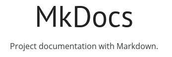

  
  

#
<h1 align="center">GETTING STARTED WITH MKDOCS: A BEGINNER'S GUIDE </h1>

Welcome to the beginner's guide to get started with MkDocs! MkDocs is a fast, and efficient static site generator to build visually appealing documentation. Mkdocs uses the Markdown and YAML syntax. This detailed guide provides the necessary steps to use MkDocs and create exceptional documentation.