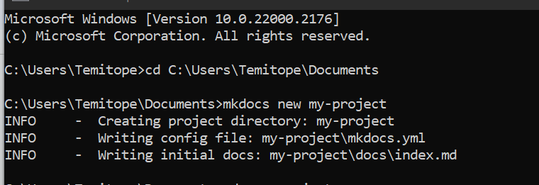
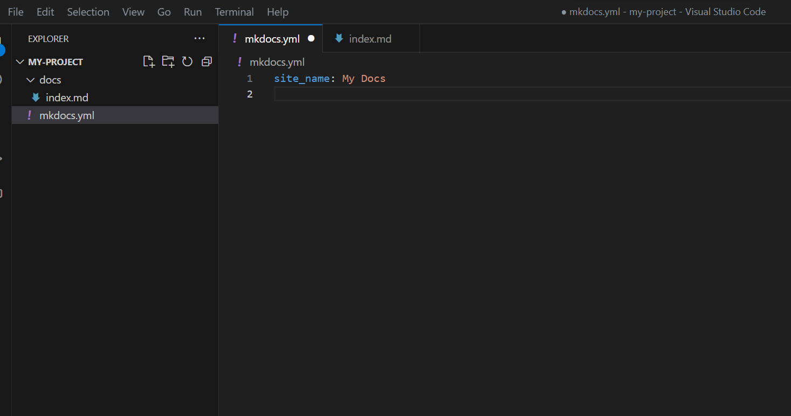
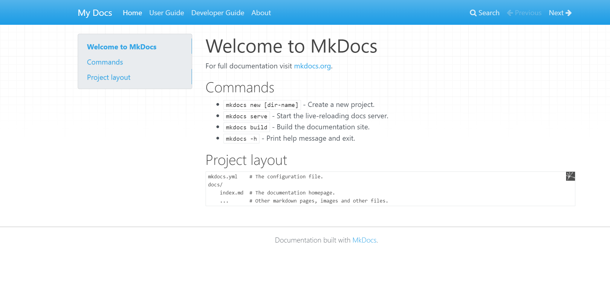
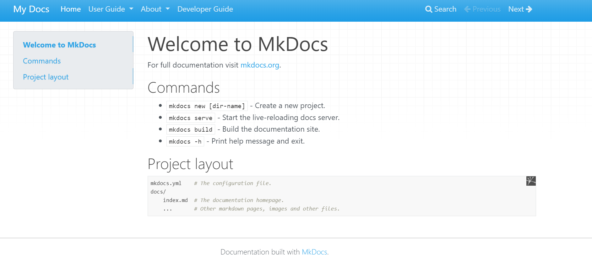
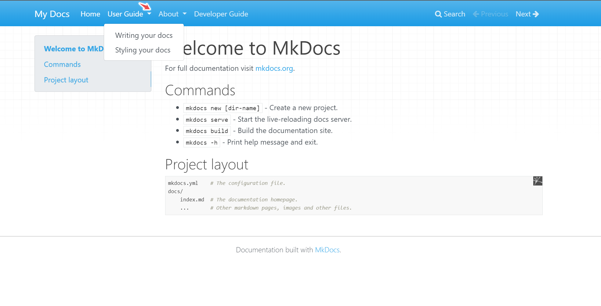
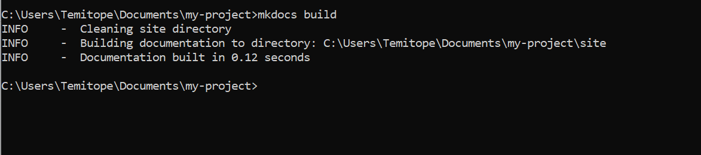

# **Preparing Documentation with Mkdocs**

## **Creating a new Project**

Now that Mkdocs is installed, let's start by creating a documentation
site with Mkdocs.

1. Choose a project directory on your local PC to save the project.

2. Create a new project by running the following commands:

```
 mkdocs new my-project
```

> 

3.**File and Folder structure**. Creating a new project will create a  new folder. The new folder called 'my-project' and it gets the  default folder structure with 'docs' folder and mkdocs.yml file. The Documentation source file will be in Markdown. The docs folder has a markdown file named 'index.md' which can be renamed. The project folder will also have a Single configuration file called mkdocs.yml. The YML file is used to add pages, and themes. It is also used to configure the project settings.

The folder structure is in this format.

>
    mkdocs.yml
    docs/
    index.md

4.Open the project in VSCode. Open it on an editor with Visual Studio code using the command in the below line.

> code .

> 

5.Load the site on your local PC on the web browser. Mkdocs has a dev server to load and preview the site. To load the site, the command prompt will need to run from the directory of the project. Run the command in the below line:

>
    cd my-project
    mkdocs serve


6.View the site on a web browser. Copy the link - [http://127.0.0.1:8000/](http://127.0.0.1:8000/) and paste it into a browser of your choice. This would load the default home page.

> 

## **Adding Files and Pages**

You have successfully created a new project. Project documentation usually have more than one page. To add more pages to your documentation, open the mkdocs.yml file. At first glance, it looks like this:

``` site_name: My Docs ```

The About Page, User Guide, and Developer Guide Pages can be added.

This involves two steps.

1. Create the files in VS Code

> 

2.Add the Pages information in the mkdocs.yml file. To prevent any errors, confirm that the new files are created in the docs folder.

 Now you have the files in mkdocs.yml.

    site_name: My Docs

    Nav:
    -Home: index.md
    -About: about.md
    -User Guide: userguide.md
    -Developer Guide: developerguide.md

> 

3.Reload the site using 'mkdocs serve' to confirm that the changes are showing.

> 

4.Subsections within pages can be created. The code below highlights creating subsections.

>
    nav:
    - Home: 'index.md'
    - User Guide:
        - Writing your docs: 'writing-your-docs.md'
        - Styling your docs: 'styling-your-docs.md'
    - About:
        - License: 'license.md'
        - Release Notes: 'release-notes.md'

> 

> 

## **Customize Theme**

Themes can be easily customized on Mkdocs. Mkdocs has its default basic theme. However, themes can be changed and customized.

Mkdocs themes can be accessed from the [GitHub MkDocs Theme Page](https://github.com/mkdocs/mkdocs/wiki/MkDocs-Themes) and the [Catalog Themes](https://github.com/mkdocs/catalog#-theming). These are some of the themes that can be used.

1.  Read the Docs. Add the command "theme: readthedocs" to mkdocs.yml and it shows the documentation in readthedocs format.

2.  Material for Mkdocs: This makes searching the documentation easy as well as creating beautiful and professional documentation. Apply it to your documentation using the [Material for Mkdocs Page](https://squidfunk.github.io/mkdocs-material/).

3.  Cinder - This is another beautiful theme that can be applied to the documentation. A step-by-step process to apply the theme is highlighted in the [Cinder Theme for Mkdocs](https://sourcefoundry.org/cinder/).

## **Build the Site**

Building the site will create a 'site' folder within the local computer containing the files. This site folder makes it easy to deploy the documentation to any site of your choice.

To build the site, run the below command.

``` 
mkdocs build
```

> 

## **Deploy the Docs**

The documentation site you just made is made up of only static files, so
you can run it from just about anywhere. Just upload the whole site
directory to the place where your website is hosted, and you\'re done.

Docs can be deployed to anywhere. [GitHub Pages](https://pages.github.com/), Read the Docs, or your site. For more information, see [Deploying the Docs Page](https://www.mkdocs.org/user-guide/deploying-your-docs/).

To deploy to GitHub Pages, publish and push the local file to a repository on GitHub. Open the repository, go to Settings and Pages. This shows the GitHub Pages settings. Select the branch to deploy from and save. Within a few minutes, a link will be generated. Copy the link and paste it in a new tab. The documentation is successfully hosted on GitHub Pages.

## **Conclusion**

Congratulations! You have successfully built a documentation site. In summary, MkDocs is a powerful tool for creating and updating documentation for open-source projects. By following these steps, you can create visually appealing and relevant documentation for projects.
